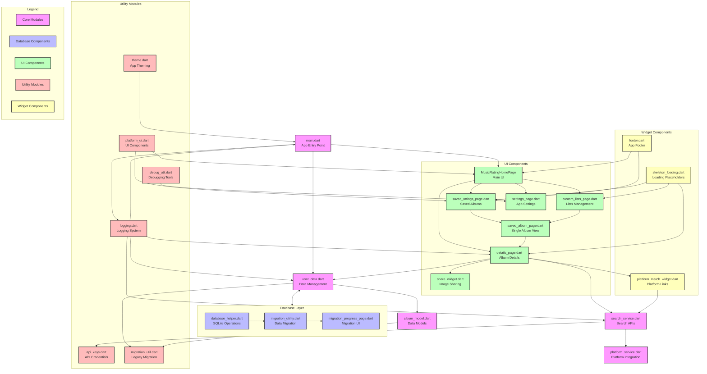

# RateMe Application Architecture

This diagram shows the full architecture and data flow of the RateMe application, including all modules and their relationships.

## Interactive Diagram (for GitHub and Mermaid-compatible tools)

## Static Image (for Obsidian and other non-Mermaid compatible tools)

For tools that don't support Mermaid rendering, you can view the diagram as a static image:

You can also access the diagram directly from MermaidChart:
[View on MermaidChart](https://www.mermaidchart.com/raw/979de47a-08ba-4f1a-b31f-3469cf6a303f?theme=light&version=v0.1&format=svg)

## Module Descriptions

### Core Modules
- **main.dart**: Application entry point and initialization
- **user_data.dart**: Central data management and persistence
- **album_model.dart**: Data models for albums and tracks
- **search_service.dart**: Music platform search APIs integration
- **platform_service.dart**: Platform-specific service integration

### Database Layer
- **database_helper.dart**: SQLite database operations
- **migration_utility.dart**: SharedPreferences to SQLite migration
- **migration_progress_page.dart**: Migration UI and progress tracking

### UI Components
- **MusicRatingHomePage**: Main app UI and search interface
- **details_page.dart**: Album details and rating interface
- **saved_ratings_page.dart**: User's saved albums collection
- **saved_album_page.dart**: Single album view from saved collection
- **custom_lists_page.dart**: Custom album lists management
- **settings_page.dart**: App settings and preferences
- **share_widget.dart**: Image generation for sharing

### Utility Modules
- **logging.dart**: Application logging system
- **api_keys.dart**: API credentials management
- **debug_util.dart**: Debugging and diagnostic tools
- **theme.dart**: App theming and styles
- **migration_util.dart**: Legacy data migration utilities
- **platform_ui.dart**: Platform-specific UI components

### Widget Components
- **skeleton_loading.dart**: Loading placeholder animations
- **platform_match_widget.dart**: Music platform linking
- **footer.dart**: App footer with version info

                                  RateMe - User Journey Linear Flow
┌───────────────────────────────────────────────────────────────────────────────────────────────────────┐
│                                                                                                       │
│  ┌─────────┐        ┌─────────┐        ┌─────────────┐        ┌───────────────┐        ┌─────────┐    │
│  │         │        │         │        │             │        │               │        │         │    │
│  │  Start  ├───────►│  Search ├───────►│ Album List  ├───────►│ Album Details ├───────►│  Rate   │    │
│  │         │        │         │        │             │        │               │        │         │    │
│  └─────────┘        └─────┬───┘        └──────┬──────┘        └───────┬───────┘        └─────┬───┘    │
│                           │                   │                       │                      │        │
│                           ▼                   ▼                       ▼                      ▼        │
│                    ┌─────────────┐     ┌─────────────┐         ┌──────────────┐      ┌─────────────┐  │
│                    │ Platform    │     │ Search      │         │ Match on     │      │ Store       │  │
│                    │ Selection   │     │ Service     │         │ External     │      │ in SQLite   │  │
│                    └─────────────┘     └─────────────┘         │ Platforms    │      └─────────────┘  │
│                                                                └──────────────┘            │          │
│                                                                                            ▼          │
│  ┌────────────┐     ┌─────────────┐     ┌─────────────┐     ┌─────────────┐     ┌─────────────┐       │
│  │            │     │             │     │             │     │             │     │             │       │
│  │ Share      │◄────┤ View        │◄────┤ Custom      │◄────┤ Saved       │◄────┤ Export      │       │
│  │ as Image   │     │ List        │     │ Lists       │     │ Albums      │     │ Backup      │       │
│  │            │     │             │     │             │     │             │     │             │       │
│  └────────────┘     └─────────────┘     └─────────────┘     └─────────────┘     └─────────────┘       │
│                                                                                                       │
└───────────────────────────────────────────────────────────────────────────────────────────────────────┘

                               Key Components and Data Flow
┌────────────────────────────────────────────────────────────────────────────────────────┐
│                                                                                        │
│  ┌─────────────┐        ┌─────────────┐        ┌─────────────┐        ┌─────────────┐  │
│  │             │        │             │        │             │        │             │  │
│  │  User       ├────1───► Search      ├────2───► Album       ├────3───► Rating      │  │
│  │  Interface  │        │ Service     │        │ Details     │        │ System      │  │
│  │             │◄───8───┤             │◄───7───┤             │◄───4───┤             │  │
│  └─────────────┘        └─────────────┘        └─────────────┘        └─────────────┘  │
│         │                      │                      │                      │         │
│         │                      │                      │                      │         │
│         9                      │                      │                      5         │
│         │                      │                      │                      │         │
│         ▼                      │                      │                      ▼         │
│  ┌─────────────┐               │                      │               ┌─────────────┐  │
│  │             │               │                      │               │             │  │
│  │  Custom     │               │                      │               │  Database   │  │
│  │  Lists      │◄──────────────┴──────────────────────┴──────────────►│  (SQLite)   │  │
│  │             │                         6                            │             │  │
│  └─────────────┘                                                      └─────────────┘  │
│                                                                                        │
└────────────────────────────────────────────────────────────────────────────────────────┘

Data Flow Steps:
1. User searches for an album on a selected platform (iTunes, Spotify, or Deezer)
2. Search results are returned and displayed in the album list
3. User selects an album to view details and rate tracks
4. User rates tracks and the data is processed by the rating system
5. Ratings are saved to the SQLite database
6. All data (albums, ratings, lists) is persisted in the database
7. Album details can be refreshed or updated
8. User returns to main interface
9. User can organize albums into custom lists for better management
